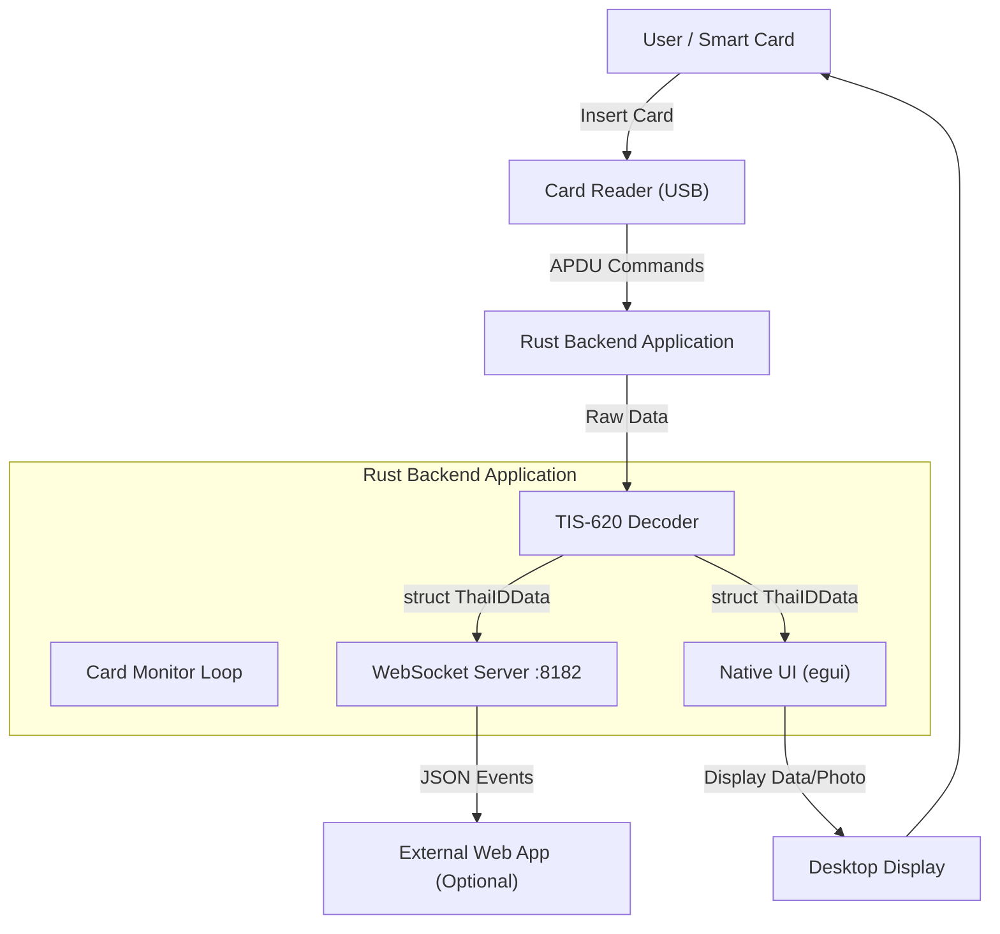

# Thai Smart Card Reader Service

A high-performance, real-time Smart Card Reader application for Thai National ID cards.
Built with **Rust**. Features a **Native UI** (using `egui`) and a **WebSocket Server** for external integration.

## Features

- **Native Rust UI**: Fast, lightweight, and cross-platform dashboard for viewing card data.
- **WebSocket API**: Broadcasts real-time data to `ws://localhost:8182/ws` for integration with web apps.
- **Real-time Reading**: Automatically detects card insertion/removal.
- **Thai ID Optimized**: Decodes TIS-620 encoding and handles Thai ID APDU commands.
- **Photo Support**: Reads and displays the cardholder's photo (base64 encoded JPEG).
- **Cross-Platform**: Supports macOS, Windows, and Linux.
- **Configurable**: Extensive TOML configuration for server, output format, field mapping, and more.

## Architecture



## Project Structure

```
.
├── smart-card-reader/
│   ├── backend/           # Rust application
│   │   ├── src/
│   │   │   ├── main.rs    # Application entry point
│   │   │   ├── config.rs  # Configuration handling
│   │   │   ├── reader.rs  # Card reader logic
│   │   │   ├── decoder.rs # TIS-620 decoder & data structures
│   │   │   ├── server.rs  # WebSocket server
│   │   │   └── ui.rs      # Native UI (egui)
│   │   ├── config.toml    # Application configuration
│   │   └── Cargo.toml     # Rust dependencies
│   └── frontend/          # React + Vite UI (optional)
└── docs/                  # Documentation & Assets
```

## Prerequisites

- **Rust**: [Install Rust](https://www.rust-lang.org/tools/install)
- **PCSC Middleware** (Required for communicating with the card reader):
  - **macOS**: Pre-installed (`SmartCardServices`).
  - **Windows**: Pre-installed (`Smart Card` service).
  - **Linux**: Install `pcscd` and `libpcsclite-dev`:
    ```bash
    sudo apt install pcscd libpcsclite-dev
    sudo systemctl start pcscd
    ```

_(Optional) **Node.js**: Required only if you plan to develop the web-based frontend._

## Quick Start

```bash
# Clone and run
cd smart-card-reader/backend
cargo run

# Build for production
cargo build --release
```

A native window will open displaying the Smart Card Reader dashboard.


The WebSocket server will start on `ws://127.0.0.1:8182/ws`.

## Configuration

The application uses `config.toml` for configuration. It searches for the config file in this order:

1. Path specified in `SMART_CARD_CONFIG` environment variable
2. `./config.toml` (current working directory)
3. `<executable-directory>/config.toml`
4. Falls back to default values

### Configuration Options

#### Server Configuration

```toml
[server]
host = "127.0.0.1"      # Bind address ("0.0.0.0" for external access)
port = 8182             # WebSocket server port
cors_allow_all = true   # Allow all CORS origins
```

#### Output Configuration

```toml
[output]
format = "standard"     # "standard" | "minimal" | "full"
include_photo = true    # Include base64 photo in output

# Field mapping - rename output field names
[output.field_mapping]
citizen_id = "nationalId"
full_name_th = "nameThai"
full_name_en = "nameEnglish"
date_of_birth = "birthDate"
# ... more mappings

# Filter output fields (empty = all fields)
enabled_fields = ["citizen_id", "full_name_th", "full_name_en"]
```

#### UI Configuration

```toml
[ui]
window_title = "Thai Smart Card Reader"
window_width = 800.0
window_height = 600.0
min_width = 600.0
min_height = 400.0
```

#### Font Configuration

```toml
[fonts]
custom_paths = ["/path/to/NotoSansThai-Regular.ttf"]
use_system_fonts = true
```

#### Logging Configuration

```toml
[logging]
level = "info"  # "trace" | "debug" | "info" | "warn" | "error"
```

#### Card Reading Configuration

```toml
[card]
select_apdu = "00A4040008A000000054480001"  # Thai ID applet SELECT
retry_attempts = 3
retry_delay_ms = 500
card_settle_delay_ms = 500

# Custom APDU commands for each field
[[card.fields]]
name = "citizen_id"
apdu = "80B0000402000D"
required = true
```

## WebSocket API

### Connection

Connect to: `ws://<host>:<port>/ws` (default: `ws://127.0.0.1:8182/ws`)

### Events

#### Card Inserted

```json
{
  "type": "CARD_INSERTED",
  "data": {
    "citizen_id": "1234567890123",
    "full_name_th": "นาย ทดสอบ ตัวอย่าง",
    "full_name_en": "Mr. Test Example",
    "date_of_birth": "25300115",
    "gender": "1",
    "card_issuer": "กรุงเทพมหานคร",
    "issue_date": "25650101",
    "expire_date": "25730101",
    "address": "123 ถนนตัวอย่าง แขวงตัวอย่าง เขตตัวอย่าง กรุงเทพฯ 10100",
    "photo": "<base64-encoded-jpeg>"
  }
}
```

#### Card Removed

```json
{
  "type": "CARD_REMOVED"
}
```

### Data Fields

| Field           | Description               | Format                   |
| --------------- | ------------------------- | ------------------------ |
| `citizen_id`    | 13-digit Thai National ID | String                   |
| `full_name_th`  | Full name in Thai         | String (Unicode)         |
| `full_name_en`  | Full name in English      | String                   |
| `date_of_birth` | Date of birth             | YYYYMMDD (Buddhist Era)  |
| `gender`        | Gender code               | "1" = Male, "2" = Female |
| `card_issuer`   | Card issuing authority    | String (Thai)            |
| `issue_date`    | Card issue date           | YYYYMMDD (Buddhist Era)  |
| `expire_date`   | Card expiry date          | YYYYMMDD (Buddhist Era)  |
| `address`       | Full address              | String (Thai)            |
| `photo`         | Cardholder photo          | Base64-encoded JPEG      |

### JavaScript Example

```javascript
const ws = new WebSocket("ws://localhost:8182/ws");

ws.onmessage = (event) => {
  const data = JSON.parse(event.data);

  if (data.type === "CARD_INSERTED") {
    console.log("Card data:", data.data);
    console.log("Citizen ID:", data.data.citizen_id);

    // Display photo
    const img = document.createElement("img");
    img.src = `data:image/jpeg;base64,${data.data.photo}`;
    document.body.appendChild(img);
  } else if (data.type === "CARD_REMOVED") {
    console.log("Card removed");
  }
};

ws.onopen = () => console.log("Connected to card reader");
ws.onclose = () => console.log("Disconnected from card reader");
ws.onerror = (error) => console.error("WebSocket error:", error);
```

## Thai Font Support

The application requires Thai fonts to display Thai text correctly. Without proper fonts, Thai characters will appear as boxes (&#9633;&#9633;&#9633;).

### Font Search Order

1. **Custom Paths**: Paths specified in `config.toml` → `[fonts].custom_paths`
2. **Bundled Font**: `fonts/NotoSansThai-Regular.ttf` (relative to executable)
3. **Windows System Fonts**: Leelawadee UI, Tahoma, Cordia New, AngsanaUPC
4. **Linux System Fonts**: Noto Sans Thai (`/usr/share/fonts/`)
5. **macOS System Fonts**: Silom, Ayuthaya, Krungthep, Sathu

### Recommended Setup

For best results, include the bundled font with your deployment:

```
your-app.exe (or smart-card-reader)
fonts/
  └── NotoSansThai-Regular.ttf
```

Download Noto Sans Thai from [Google Fonts](https://fonts.google.com/noto/specimen/Noto+Sans+Thai).

## Building for Production

```bash
cd smart-card-reader/backend

# Build optimized release binary
cargo build --release

# Binary location
ls target/release/smart-card-reader
```

### Cross-Platform Notes

- **Windows**: The binary is a standalone `.exe` file
- **macOS**: Create an `.app` bundle for distribution
- **Linux**: Ensure `pcscd` service is running

## Environment Variables

| Variable            | Description         | Default                      |
| ------------------- | ------------------- | ---------------------------- |
| `SMART_CARD_CONFIG` | Path to config.toml | (searches default locations) |
| `RUST_LOG`          | Log level override  | (uses config.toml value)     |

## Troubleshooting

### No Card Detected

- Ensure your smart card reader driver is installed
- Check that the card is inserted correctly (chip facing up/down depending on reader)
- Verify the reader is recognized by the system:
  - **Windows**: Device Manager → Smart card readers
  - **macOS**: System Information → USB
  - **Linux**: `pcsc_scan` command

### Connection Error

- Ensure the backend is running
- Check that port `8182` (or configured port) is not blocked by firewall
- Verify WebSocket URL matches your configuration

### Linux-Specific

```bash
# Start PC/SC daemon
sudo systemctl start pcscd

# Check status
sudo systemctl status pcscd

# Install required packages
sudo apt install pcscd libpcsclite-dev pcsc-tools
```

### Thai Text Shows as Boxes (&#9633;&#9633;&#9633;)

| Platform | Solution                                                                                               |
| -------- | ------------------------------------------------------------------------------------------------------ |
| Windows  | Install Windows updates (Leelawadee UI included in Win 10/11), or add `fonts/NotoSansThai-Regular.ttf` |
| Linux    | `sudo apt install fonts-noto-core` or `fonts-thai-tlwg`                                                |
| macOS    | Thai fonts pre-installed. If issues persist, install Noto Sans Thai                                    |

Check application logs for "Thai font not found" messages to see which paths were searched.

### Debug Logging

Enable debug logging for more detailed output:

```toml
# config.toml
[logging]
level = "debug"
```

Or via environment variable:

```bash
RUST_LOG=debug cargo run
```

## (Optional) Web Frontend

If you wish to use the React-based frontend:

```bash
cd smart-card-reader/frontend
npm install
npm run dev
```

## License

MIT License

## Contributing

1. Fork the repository
2. Create a feature branch (`git checkout -b feature/amazing-feature`)
3. Commit your changes (`git commit -m 'Add amazing feature'`)
4. Push to the branch (`git push origin feature/amazing-feature`)
5. Open a Pull Request
