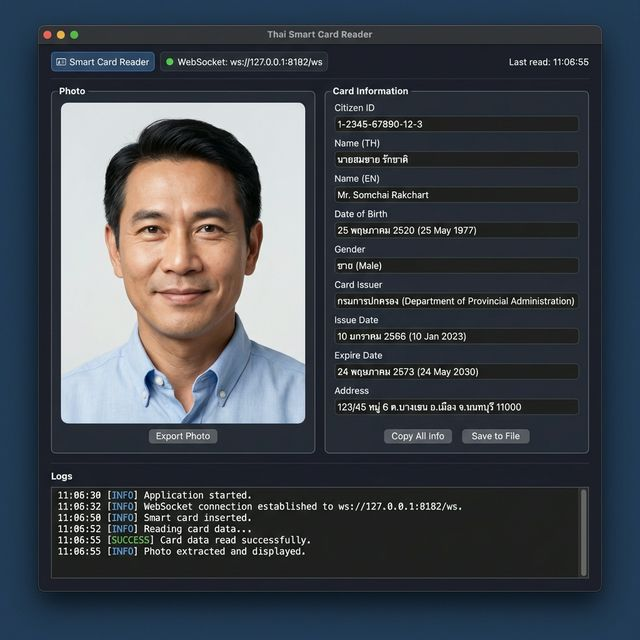

# Thai Smart Card Reader Service

A high-performance, real-time Smart Card Reader service for Thai National ID cards.
Built with **Rust** (Backend) and **React + Vite** (Frontend).



## Features

- **Real-time Reading**: Automatically detects card insertion/removal.
- **Thai ID Optimized**: Decodes TIS-620 encoding and handles Thai ID APDU commands.
- **Photo Support**: Reads and reconstructs the cardholder's photo.
- **WebSocket API**: Broadcasts data to `ws://localhost:8182/ws`.
- **Modern UI**: Glassmorphism dashboard for data visualization.
- **Cross-Platform**: Supports macOS, Windows, and Linux.

## Architecture

```mermaid
graph TD
    User[User / Smart Card] -->|Insert Card| Reader[Card Reader (USB)]
    Reader -->|APDU Commands| Backend[Rust Backend]
    
    subgraph "Rust Backend"
        Monitor[Card Monitor Loop]
        Decoder[TIS-620 Decoder]
        WSS[WebSocket Server :8182]
    end
    
    Backend -->|Raw Data| Decoder
    Decoder -->|JSON Data| WSS
    WSS -->|JSON Events| Frontend[React Frontend]
    
    subgraph "React Frontend"
        UI[Glassmorphism UI]
        Hook[useCardReader Hook]
    end
    
    Frontend -->|Display Data/Photo| User
```

## Project Structure

```
.
├── smart-card-reader/
│   ├── backend/      # Rust WebSocket Server & Validating Logic
│   └── frontend/     # React + Vite UI
└── docs/             # Documentation & Assets
```

## Prerequisites

- **Rust**: [Install Rust](https://www.rust-lang.org/tools/install)
- **Node.js**: [Install Node.js](https://nodejs.org/) (v16+)
- **PCSC Middleware**:
    - **macOS**: Pre-installed (`SmartCardServices`).
    - **Windows**: Pre-installed (`Smart Card` service).
    - **Linux**: Install `pcscd` and `libpcsclite-dev` (e.g., `sudo apt install pcscd libpcsclite-dev`).

## Development

### 1. Start Backend (Rust)
The backend listens for smart card events and runs the WebSocket server.

```bash
cd smart-card-reader/backend
cargo run
```
*Server will start on `127.0.0.1:8182`.*

### 2. Start Frontend (React)
The frontend connects to the backend to display card data.

```bash
cd smart-card-reader/frontend
npm install
npm run dev
```
*Open your browser to the URL shown (usually `http://localhost:5173`).*

## Building for Production

### Backend
Build an optimized binary:
```bash
cd smart-card-reader/backend
cargo build --release
```
The binary will be in `smart-card-reader/backend/target/release/smart-card-reader`.

### Frontend
Build static files for deployment:
```bash
cd smart-card-reader/frontend
npm run build
```
The static files will be in `smart-card-reader/frontend/dist`.

## Troubleshooting
- **No Card Detected**: Ensure your smart card reader driver is installed and the card is inserted correctly.
- **Connection Error**: Ensure the backend is running and port `8182` is not blocked.
- **Linux**: Ensure the `pcscd` service is running (`sudo systemctl start pcscd`).
