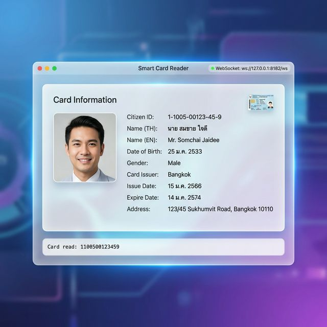
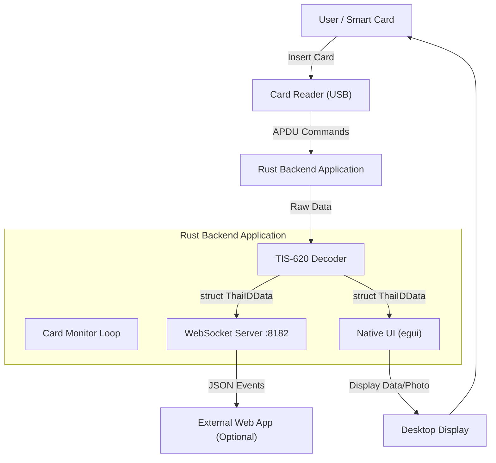

# Thai Smart Card Reader Service



A high-performance, real-time Smart Card Reader application for Thai National ID cards.
Built with **Rust**. Features a **Native UI** (using `egui`) and a **WebSocket Server** for external integration.

## Features

- **Native Rust UI**: Fast, lightweight, and cross-platform dashboard for viewing card data.
- **WebSocket API**: Broadcasts real-time data to `ws://localhost:8182/ws` for integration with web apps.
- **Real-time Reading**: Automatically detects card insertion/removal.
- **Thai ID Optimized**: Decodes TIS-620 encoding and handles Thai ID APDU commands.
- **Photo Support**: Reads and displays the cardholder's photo.
- **Cross-Platform**: Supports macOS, Windows, and Linux.

## Architecture



## Project Structure

```
.
├── smart-card-reader/
│   ├── backend/      # Rust WebSocket Server & Validating Logic
│   └── frontend/     # React + Vite UI
└── docs/             # Documentation & Assets
```

## Prerequisites

- **Rust**: [Install Rust](https://www.rust-lang.org/tools/install)
- **PCSC Middleware** (Required for communicating with the card reader):
  - **macOS**: Pre-installed (`SmartCardServices`).
  - **Windows**: Pre-installed (`Smart Card` service).
  - **Linux**: Install `pcscd` and `libpcsclite-dev` (e.g., `sudo apt install pcscd libpcsclite-dev`).

_(Optional) **Node.js**: Required only if you plan to develop the web-based frontend._

## Development

The application is a self-contained Rust executable that launches a native UI and a WebSocket server.

### Run the Application

```bash
cd smart-card-reader/backend
cargo run
```

- A window will open displaying the Smart Card Reader dashboard.
- The WebSocket server will start on `ws://127.0.0.1:8182/ws`.

### (Optional) Web Frontend

If you wish to use the React-based frontend:

```bash
cd smart-card-reader/frontend
npm install
npm run dev
```

## Building for Production

Build an optimized binary for your platform:

```bash
cd smart-card-reader/backend
cargo build --release
```

The binary will be located in `smart-card-reader/backend/target/release/`.

## Thai Font Support

The application requires Thai fonts to display Thai text correctly. Without proper fonts, Thai characters will appear as boxes (□□□).

### Font Search Order

The application searches for fonts in this order:

1. **Bundled Font**: `fonts/NotoSansThai-Regular.ttf` (relative to executable)
2. **Windows System Fonts**: Leelawadee UI, Tahoma, Cordia New, AngsanaUPC
3. **Linux System Fonts**: Noto Sans Thai (`/usr/share/fonts/`)
4. **macOS System Fonts**: Silom, Ayuthaya, Krungthep, Sathu

### Recommended Setup

For best results, include the bundled font with your deployment:

```
your-app.exe (or smart-card-reader)
fonts/
  └── NotoSansThai-Regular.ttf
```

You can download Noto Sans Thai from [Google Fonts](https://fonts.google.com/noto/specimen/Noto+Sans+Thai).

## Troubleshooting

- **No Card Detected**: Ensure your smart card reader driver is installed and the card is inserted correctly.
- **Connection Error**: Ensure the backend is running and port `8182` is not blocked.
- **Linux**: Ensure the `pcscd` service is running (`sudo systemctl start pcscd`).
- **Thai Text Shows as Boxes (□□□)**:
  - **Windows**: Ensure Windows is updated (Leelawadee UI font should be pre-installed on Windows 10/11). Alternatively, place `fonts/NotoSansThai-Regular.ttf` next to the executable.
  - **Linux**: Install Thai fonts: `sudo apt install fonts-noto-core` or `fonts-thai-tlwg`.
  - **macOS**: Thai fonts are pre-installed. If issues persist, install Noto Sans Thai.
  - Check application logs for "Thai font not found" messages to see which paths were searched.
